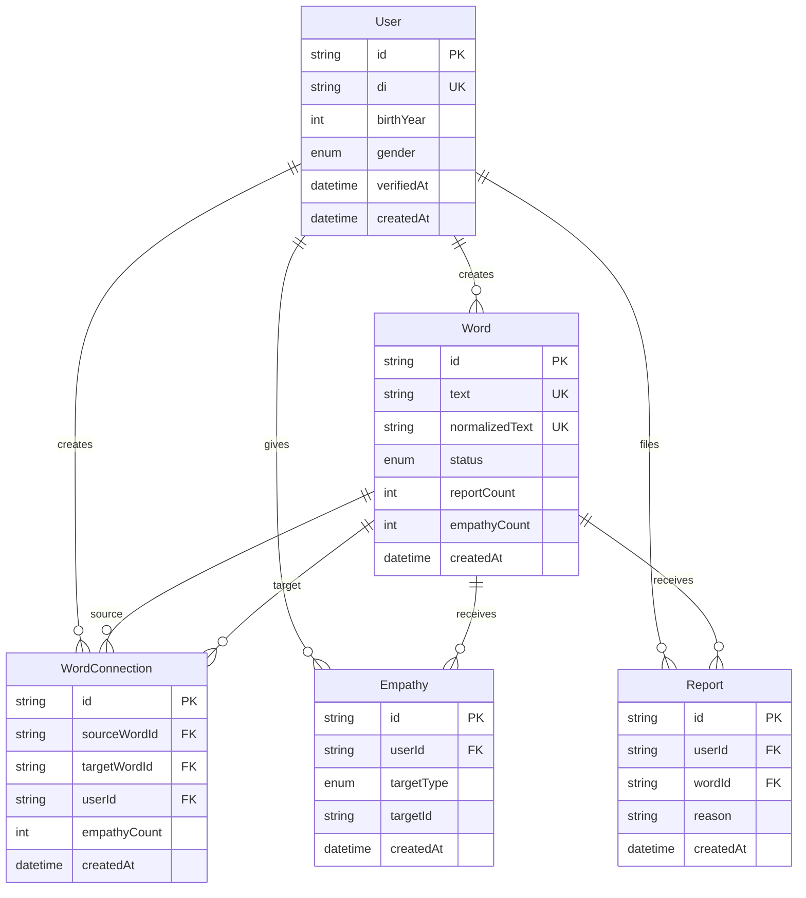

# MyMind — DB/API 설계

## 1. 개요

단어 중심의 생각 공유 서비스. 핵심 엔티티는 **단어(Word)**, **연결(Connection)**, **공감(Empathy)**, **사용자(User)**, **신고(Report)**.

```
[User] ──creates──> [Word]
[User] ──creates──> [WordConnection] ── links ──> [Word] ↔ [Word]
[User] ──gives──> [Empathy] ── on ──> [Word] | [WordConnection]
[User] ──files──> [Report] ── on ──> [Word]
```

---

## 2. ER 다이어그램



---

## 3. 테이블 상세

### 3.1 User (사용자)

| 컬럼 | 타입 | 설명 |
|------|------|------|
| id | UUID | PK |
| di | VARCHAR(88) | 본인인증 DI (중복가입방지, UK) |
| birthYear | INT | 출생연도 (연령대 집계용) |
| gender | ENUM | MALE, FEMALE, OTHER, UNKNOWN |
| verifiedAt | TIMESTAMP | 본인인증 완료 시각 |
| createdAt | TIMESTAMP | 가입 시각 |

- **저장하지 않는 것**: 실명, 전화번호 (인증 API에서만 사용, DB 미저장 권장)
- **연령대 계산**: `birthYear` → 10·20·30·40·50·60대 (서버에서 변환)

### 3.2 Word (단어)

| 컬럼 | 타입 | 설명 |
|------|------|------|
| id | UUID | PK |
| text | VARCHAR(20) | 표시용 원문 (UK) |
| normalizedText | VARCHAR(20) | 정규화 텍스트 (검색·중복 방지, UK) |
| status | ENUM | ACTIVE, HIDDEN, PENDING_REVIEW |
| reportCount | INT | 누적 신고 수 (비정규화) |
| empathyCount | INT | 누적 공감 수 (비정규화) |
| createdById | UUID | FK → User (nullable, 익명 집계 시 null 가능) |
| createdAt | TIMESTAMP | 등록 시각 |

**status 전환 규칙**

- `reportCount >= 5` → 자동 `HIDDEN` (MVP 기본값, 설정 가능)
- 관리자 수동 복구 → `ACTIVE`

### 3.3 WordConnection (단어 연결)

| 컬럼 | 타입 | 설명 |
|------|------|------|
| id | UUID | PK |
| sourceWordId | UUID | FK → Word (중심 단어) |
| targetWordId | UUID | FK → Word (연결 단어) |
| userId | UUID | FK → User |
| empathyCount | INT | 이 연결에 대한 공감 수 |
| createdAt | TIMESTAMP | 등록 시각 |

**제약**

- UNIQUE(sourceWordId, targetWordId, userId) — 동일 유저의 중복 연결 방지
- sourceWordId ≠ targetWordId

### 3.4 Empathy (공감)

| 컬럼 | 타입 | 설명 |
|------|------|------|
| id | UUID | PK |
| userId | UUID | FK → User |
| targetType | ENUM | WORD, CONNECTION |
| targetId | UUID | Word.id 또는 WordConnection.id |
| createdAt | TIMESTAMP | 공감 시각 |

**제약**

- UNIQUE(userId, targetType, targetId) — 1인 1공감

### 3.5 Report (신고)

| 컬럼 | 타입 | 설명 |
|------|------|------|
| id | UUID | PK |
| userId | UUID | FK → User |
| wordId | UUID | FK → Word |
| reason | ENUM | PROFANITY, HATE, SPAM, OTHER |
| createdAt | TIMESTAMP | 신고 시각 |

**제약**

- UNIQUE(userId, wordId) — 동일 유저의 중복 신고 방지

---

## 4. 인덱스

| 테이블 | 인덱스 | 용도 |
|--------|--------|------|
| Word | normalizedText | 검색 |
| Word | status, empathyCount DESC | 트렌드 |
| WordConnection | sourceWordId, empathyCount DESC | 단어 상세 — 연결 랭킹 |
| WordConnection | targetWordId, empathyCount DESC | 역방향 탐색 |
| Empathy | targetType, targetId | 공감 집계 |
| Empathy | userId, createdAt | 유저 활동 |

---

## 5. REST API

Base URL: `/api/v1`

### 5.1 인증

| Method | Path | 설명 |
|--------|------|------|
| POST | `/auth/verify` | 본인인증 완료 콜백 (DI, birthYear, gender) |
| GET | `/auth/me` | 현재 로그인 사용자 |
| POST | `/auth/logout` | 세션 종료 |

**MVP**: `POST /auth/verify`는 mock 토큰 발급. 프로덕션에서 NICE/KCB PASS 연동.

### 5.2 단어

| Method | Path | 설명 |
|--------|------|------|
| GET | `/words/trending` | 실시간 상승 단어 |
| GET | `/words/search?q=` | 단어 검색 (ACTIVE만) |
| GET | `/words/:id` | 단어 상세 + 연결 랭킹 |
| POST | `/words` | 단어 등록 |
| POST | `/words/:id/connections` | 연결 단어 추가 |

**GET /words/trending**

Query: `limit=20`, `gender?`, `ageGroup?` (10s|20s|30s|40s|50s|60s)

```json
{
  "items": [
    {
      "id": "uuid",
      "text": "트럼프",
      "empathyCount": 1523,
      "delta24h": 89,
      "rank": 1
    }
  ],
  "updatedAt": "2026-06-20T12:00:00Z"
}
```

**GET /words/:id**

Query: `gender?`, `ageGroup?`, `direction=out|in` (out=나가는 연결, in=들어오는 연결)

```json
{
  "word": { "id": "...", "text": "트럼프", "empathyCount": 1523 },
  "connections": [
    {
      "id": "conn-uuid",
      "word": { "id": "...", "text": "관세" },
      "empathyCount": 412,
      "userEmpathized": false
    }
  ]
}
```

**POST /words**

```json
{ "text": "트럼프" }
```

Validation:
- 2~20자, 공백·문장부호 불가
- 욕설 사전 필터
- 중복 시 기존 Word 반환

**POST /words/:id/connections**

```json
{ "targetText": "관세" }
```

### 5.3 공감

| Method | Path | 설명 |
|--------|------|------|
| POST | `/empathy` | 공감 등록 |
| DELETE | `/empathy` | 공감 취소 |

```json
{ "targetType": "WORD", "targetId": "uuid" }
```

### 5.4 신고

| Method | Path | 설명 |
|--------|------|------|
| POST | `/reports` | 단어 신고 |

```json
{ "wordId": "uuid", "reason": "PROFANITY" }
```

---

## 6. 실시간 (WebSocket / SSE)

| Event | Payload | 설명 |
|-------|---------|------|
| `trending:update` | `{ items: TrendingItem[] }` | 트렌드 갱신 (30초~1분) |
| `word:empathy` | `{ wordId, empathyCount }` | 단어 공감 수 변경 |

MVP: SSE `/api/v1/stream/trending` 또는 클라이언트 polling (30초).

---

## 7. 비즈니스 규칙 요약

1. 입력은 **단어·부사만** (서버 검증)
2. 욕설 사전 → 등록 거부
3. 신고 5회 → `HIDDEN` (텍스트 `***`로 대체 표시)
4. 공감·연결·신고는 **인증된 유저만**
5. 성별·연령대 필터는 Empathy JOIN User 집계 (최소 n=30 미만이면 "표본 부족" 표시)
