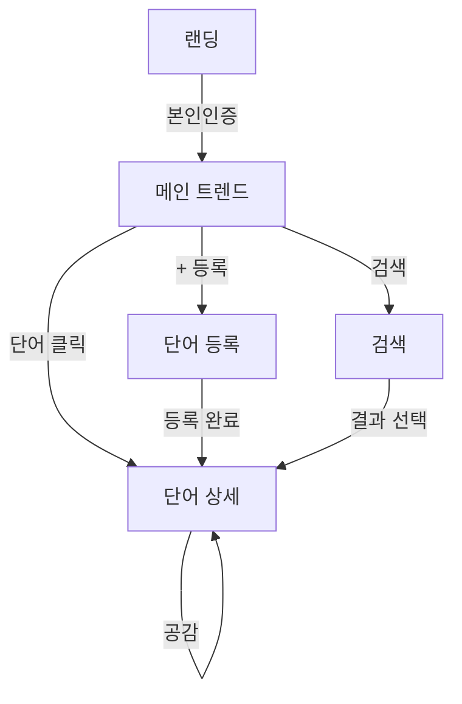

# MyMind — 화면 와이어프레임

## 화면 목록

| # | 화면 | 경로 | 설명 |
|---|------|------|------|
| 1 | 랜딩/가입 | `/` | 서비스 소개 + 본인인증 |
| 2 | 메인 (트렌드) | `/home` | 실시간 상승 단어 |
| 3 | 단어 상세 | `/words/[id]` | 연결 단어 + 공감 |
| 4 | 단어 등록 | `/words/new` | 중심 단어 + 연결 단어 입력 |
| 5 | 검색 | `/search` | 단어 검색 |
| 6 | 필터 패널 | (공통) | 성별·연령대 필터 |

---

## 1. 랜딩 / 가입 (`/`)

```
┌─────────────────────────────────────────┐
│  MyMind                          [로그인]│
├─────────────────────────────────────────┤
│                                         │
│         🧠 생각을 단어로 연결하세요        │
│                                         │
│    트럼프 ── 관세 ── 전쟁 ── 미국         │
│         \                               │
│          └── 대통령                      │
│                                         │
│   실시간으로 오르는 단어에 공감하고,        │
│   연결된 생각을 함께 탐색합니다.           │
│                                         │
│   ┌─────────────────────────────────┐   │
│   │  📱 PASS / 휴대폰 본인인증 시작   │   │
│   └─────────────────────────────────┘   │
│                                         │
│   본인인증 후 성별·연령대 통계에만         │
│   활용됩니다. 실명은 공개되지 않습니다.     │
│                                         │
└─────────────────────────────────────────┘
```

**인증 완료 후** → `/home` 리다이렉트

---

## 2. 메인 — 실시간 트렌드 (`/home`)

```
┌─────────────────────────────────────────┐
│  MyMind    [🔍 검색]  [+ 단어등록]  👤   │
├─────────────────────────────────────────┤
│  필터: [전체▼] [성별▼] [연령대▼]  🔄 Live │
├─────────────────────────────────────────┤
│  🔥 지금 오르는 단어                      │
│                                         │
│  ┌───────────────────────────────────┐  │
│  │ 1  트럼프          ▲89   ❤️ 1,523  │  │
│  │    [공감]  [상세보기 →]             │  │
│  └───────────────────────────────────┘  │
│  ┌───────────────────────────────────┐  │
│  │ 2  김정은          ▲54   ❤️ 892   │  │
│  │    [공감]  [상세보기 →]             │  │
│  └───────────────────────────────────┘  │
│  ┌───────────────────────────────────┐  │
│  │ 3  관세            ▲41   ❤️ 654   │  │
│  │    [공감]  [상세보기 →]             │  │
│  └───────────────────────────────────┘  │
│                                         │
│  ── 30초마다 자동 갱신 ──                 │
└─────────────────────────────────────────┘
```

**인터랙션**

- `[공감]` → 해당 **단어**에 공감 (토글)
- `[상세보기]` → `/words/[id]`
- 카드 탭 → 단어 상세
- `🔄 Live` → SSE 연결 상태 표시

---

## 3. 단어 상세 (`/words/[id]`)

예: "트럼프" 또는 "무서움" 클릭 시

```
┌─────────────────────────────────────────┐
│  ← 뒤로          MyMind                 │
├─────────────────────────────────────────┤
│                                         │
│         ┌─────────────┐                 │
│         │   트럼프     │  ❤️ 1,523      │
│         └─────────────┘                 │
│         [공감하기]  [🚩 신고]            │
│                                         │
│  필터: [전체▼] [성별▼] [연령대▼]         │
├─────────────────────────────────────────┤
│  연결된 단어 (공감 많은 순)               │
│                                         │
│  1  관세        ████████░░  412  [공감]  │
│  2  전쟁        ██████░░░░  301  [공감]  │
│  3  미국        █████░░░░░  287  [공감]  │
│  4  대통령      ████░░░░░░  198  [공감]  │
│  5  제멋대로    ███░░░░░░░  156  [공감]  │
│                                         │
│  ── 이 단어로 연결 추가 ──               │
│  [+ 연결 단어 등록]                      │
└─────────────────────────────────────────┘
```

**역방향 탭** (무서움 → 김정은, 핵무기 등)

```
┌─────────────────────────────────────────┐
│  [ 나가는 연결 ]  [ 들어오는 연결 ]       │
└─────────────────────────────────────────┘
```

- **나가는 연결**: 이 단어 → 다른 단어 (트럼프 → 관세)
- **들어오는 연결**: 다른 단어 → 이 단어 (김정은 → 무서움)

**공감 대상**

- 단어 자체 공감 (Word)
- 특정 **연결**(Connection) 공감 — "트럼프-관세" 연결에 공감

---

## 4. 단어 등록 (`/words/new`)

```
┌─────────────────────────────────────────┐
│  ← 뒤로     새 단어 등록                 │
├─────────────────────────────────────────┤
│                                         │
│  중심 단어 *                             │
│  ┌─────────────────────────────────┐    │
│  │ 트럼프                           │    │
│  └─────────────────────────────────┘    │
│  2~20자, 단어·부사만 (문장 불가)          │
│                                         │
│  연결 단어 (최대 5개)                     │
│  ┌─────────────────────────────────┐    │
│  │ 미국                             │    │
│  └─────────────────────────────────┘    │
│  ┌─────────────────────────────────┐    │
│  │ 대통령                           │    │
│  └─────────────────────────────────┘    │
│  [+ 연결 단어 추가]                      │
│                                         │
│  ⚠️ 욕설·비속어는 등록되지 않습니다       │
│                                         │
│  ┌─────────────────────────────────┐    │
│  │           등록하기                │    │
│  └─────────────────────────────────┘    │
└─────────────────────────────────────────┘
```

**플로우**

1. 중심 단어 입력 + 연결 단어 1개 이상
2. 서버 검증 (길이, 욕설, 중복)
3. 성공 → `/words/[id]` 이동

---

## 5. 검색 (`/search`)

```
┌─────────────────────────────────────────┐
│  ← 뒤로     단어 검색                    │
├─────────────────────────────────────────┤
│  ┌─────────────────────────────────┐    │
│  │ 🔍  트럼                         │    │
│  └─────────────────────────────────┘    │
│                                         │
│  검색 결과                               │
│  ┌───────────────────────────────────┐  │
│  │ 트럼프              ❤️ 1,523  →    │  │
│  └───────────────────────────────────┘  │
│                                         │
│  (결과 없음 시)                          │
│  "트럼"과 일치하는 단어가 없습니다.       │
│  [새 단어로 등록하기]                     │
└─────────────────────────────────────────┘
```

---

## 6. 공통 UX 패턴

### 공감 버튼 상태

| 상태 | 표시 |
|------|------|
| 미공감 | `♡ 공감` (outline) |
| 공감함 | `❤️ 공감 취소` (filled) |
| 로딩 | 스피너 |

### HIDDEN 단어

```
┌───────────────────────────────────┐
│ ***  (신고로 비노출)    🚩 신고됨   │
└───────────────────────────────────┘
```

### 신고 모달

```
┌─────────────────────────┐
│  이 단어를 신고하시겠습니까?  │
│                         │
│  ○ 욕설·비속어            │
│  ○ 혐오 표현              │
│  ○ 스팸                  │
│  ○ 기타                  │
│                         │
│  [취소]      [신고하기]   │
└─────────────────────────┘
```

### 표본 부족 (세그먼트 필터)

```
ℹ️ 선택한 조건의 데이터가 30건 미만이라
   집계를 표시하지 않습니다.
```

---

## 7. 사용자 플로우



---

## 8. 모바일 우선

- 하단 네비게이션 (모바일):

```
┌─────────────────────────────────────────┐
│              (콘텐츠)                    │
├─────────────────────────────────────────┤
│  🏠 홈    🔍 검색    ➕ 등록    👤 내정보  │
└─────────────────────────────────────────┘
```

- MVP는 **반응형 웹**으로 시작, 이후 React Native / PWA 확장
