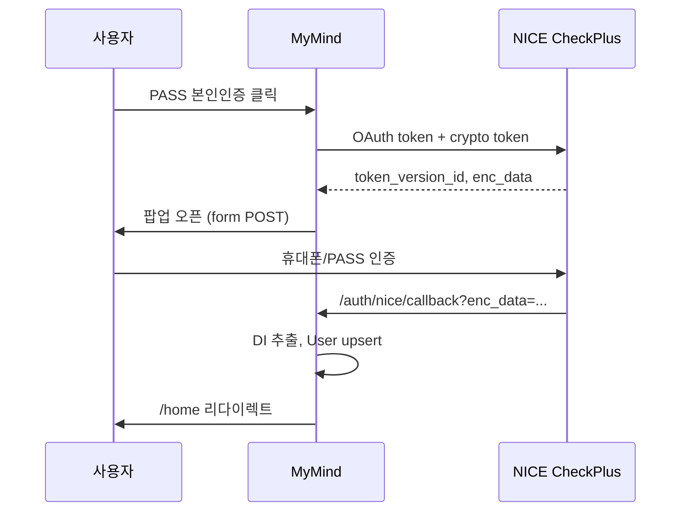

# NICE CheckPlus (PASS) 본인인증 연동

## 개요

MyMind는 **NICE평가정보 CheckPlus** API를 통해 PASS/휴대폰 본인인증을 지원합니다.

- API 키 **미설정** → mock 본인인증 (개발용)
- API 키 **설정** → NICE 표준 팝업 인증

## 환경 변수

```env
NICE_CLIENT_ID="발급받은 Client ID"
NICE_CLIENT_SECRET="발급받은 Client Secret"
NICE_PRODUCT_ID="상품 코드"
NICE_RETURN_URL="http://localhost:3000/auth/nice/callback"
APP_URL="http://localhost:3000"
```

## 연동 흐름



## API

| Method | Path | 설명 |
|--------|------|------|
| GET | `/api/v1/auth/nice/init` | 인증 초기화 (mock/nice 분기) |
| POST | `/api/v1/auth/nice/callback` | 인증 결과 처리 |

## 저장 정보

| 항목 | 저장 | 용도 |
|------|------|------|
| DI | ✅ | 1인 1계정 |
| CI | ❌ (선택) | 필요 시 암호화 저장 |
| 실명 | ❌ | 미저장 |
| 전화번호 | ❌ | 미저장 |
| 출생연도 | ✅ | 연령대 통계 |
| 성별 | ✅ | 세그먼트 통계 |

## NICE 개발자 등록

1. [NICE API 포털](https://www.niceapi.co.kr) 가입
2. CheckPlus 본인확인 상품 신청
3. Client ID / Secret 발급
4. `.env`에 설정 후 서버 재시작

## 프로덕션 체크리스트

- [ ] `NICE_RETURN_URL`을 HTTPS 프로덕션 도메인으로 설정
- [ ] NICE 관리자 콘솔에 return URL 등록
- [ ] `SESSION_SECRET`, `ADMIN_SECRET` 강력한 값으로 교체
- [ ] DI 필드 DB 암호화 (at-rest)

## Mock 모드

개발 중에는 랜딩 페이지에서 출생연도·성별만 입력해 mock DI로 가입합니다.
동일 DI는 `upsert`되어 중복 가입이 방지됩니다.
